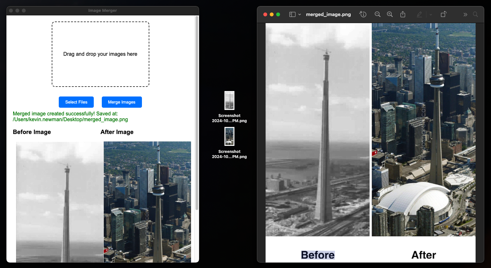

# Image Merge Electron App

This project is an Electron-based desktop application that allows users to merge two images (before and after) side by side. 



## Features

- **Drag and Drop**: Easily drag two images to the app to merge them.
- **File Selection Dialog**: Use the "Select Files" button to choose images through a dialog.
- **Padding and Text**: Add padding between the images and labels ("Before" and "After") below the images.
- **Auto-increment File Names**: Avoid overwriting files by automatically creating new file names if a merged image already exists.
- **Dynamic Resizing**: Automatically resize the second image to match the height of the first image.

## Requirements

- **Node.js** (v20 or later)
- **Electron** (latest version) - installed globally

## Installation

1. Clone the repository:

```bash
git clone https://github.com/HellooooNewman/image-merge-electron.git
cd image-merge-electron
```

Install the dependencies:

```bash
npm install
```
Run the app:
```bash
npm start
```

Usage
Drag and Drop: Open the app and drag two image files into the drop area.
File Selection: Alternatively, click on the "Select Files" button and choose two image files from your file system.
Merge: Once both images are selected, click the "Merge" button. The merged image will be saved in the same directory as the first selected image.
View Result: The merged image will not overwrite existing files. If a file named merged_image.png exists, the new file will be named merged_image_1.png, and so on.
Example
After selecting or dropping your images:

```bash
Merged image created successfully! Saved at: /path/to/merged_image.png
```
Configuration
Padding: You can adjust the padding between images by modifying the padding variable in main.js.
Text Size: Text labels are dynamically sized based on the height of the images. You can tweak the fontSize multiplier in mergeImagesSideBySide() to adjust the size further.

File Structure
```bash
image-merge-electron/
│
├── main.js                  # Main Electron process logic
├── index.html               # Frontend HTML interface
├── index.js                 # Renderer process logic
├── style.css                # CSS for styling the app
├── package.json             # Project configuration and dependencies
└── README.md                # This file
```

Technologies Used
Electron: Provides the desktop application framework.
Sharp: Used for image processing and manipulation.
@electron/remote: Enables remote access to Electron modules from the renderer process.
Troubleshooting
Issue: "Input buffer contains unsupported image format"
This error occurs when the input images are in an unsupported format. Ensure the images are in jpg, jpeg, or png format before attempting to merge them.

How to Verify Node.js and Electron Versions
Make sure you are using the correct Node.js and Electron versions. Use the following commands:

```bash
node -v
electron -v
```
If Electron is using an outdated version of Node.js, make sure to update it by reinstalling Electron.


## License
This project is licensed under the MIT License. See the LICENSE file for details.

## Contributing
Feel free to open an issue or submit a pull request if you find a bug or have a feature request!

### Key Sections Included:
- **Overview**: Description of the app's purpose.
- **Features**: A breakdown of what the app can do.
- **Installation & Setup**: Step-by-step guide to getting the app running.
- **Usage Instructions**: Directions for using both drag-and-drop and file selection.
- **File Structure**: An outline of important files in the project.
- **Troubleshooting**: Common errors and how to resolve them.
- **Contributing**: Information for future contributors.

Let me know if you'd like any adjustments or additions!